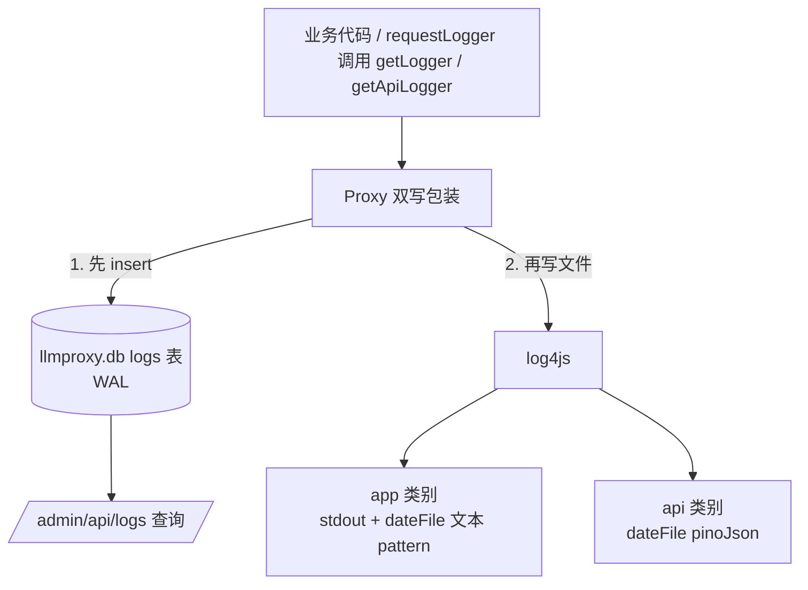
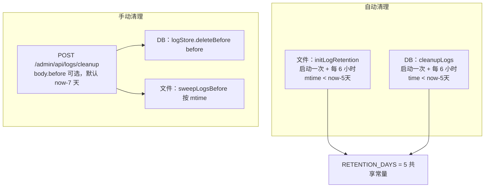

# 日志系统架构

> 本文基于当前代码实际状态（`logger/index.ts`、`logger/sweep.ts`、`logstore/index.ts`、`server/admin.ts`、`server/index.ts`）。
> 日志 SQLite 化后，管理端查询完全走 SQLite，不再读日志文件。

## 1. 双写架构

日志同时写入**文件**（log4js，按日轮转）与 **SQLite**（LogStore，供管理端查询），两者通过 `setLogStore` 装配关联：



双写包装只在装配层调用 `setLogStore(logStore)` 后生效；未装配时 `getLogger` 行为与纯文件完全一致（现有调用零感知）。

### 1.1 log4js 双类别（`logger/index.ts`）

两个 category，配置外置于 `~/llmproxy/log4js.json`（首次启动自动写入默认值，用户可编辑；自定义配置解析失败**故意不静默覆盖**，让运维看见错误）：

| category | appender | layout | 产物 |
| --- | --- | --- | --- |
| `app`（缺省） | `appStdout` + `appFile` | 文本 pattern `[%d{yyyy-MM-ddThh:mm:ss.SSS}] [%p] [%c] %m` | `logs/app-YYYY-MM-DD.log` |
| `api` | `apiFile` | 自定义 `pinoJson`（level/time/msg + 任意字段，与原 pino 输出契约一致） | `logs/api-YYYY-MM-DD.log` |

```ts
appFile: { type: 'dateFile', filename: join(logDir, 'app'), pattern: 'yyyy-MM-dd.log',
           alwaysIncludePattern: true, keepFileExt: false, fileNameSep: '-', ... }
```

- `fileNameSep: '-'` 产出 `app-2026-08-03.log` 形式（streamroller 默认分隔符是 `.`）。
- api 类别只写文件（不镜像 stdout），stdout 仅 app 类别，便于 docker/tmux 直接看。

### 1.2 setLogStore + Proxy 双写包装

`setLogStore(store)` 注入 LogStore 并使包装缓存整体失效；`getLogger(name?)` 按 category 缓存原始 Logger，装配后按 name 缓存包装：

```ts
function wrapLoggerWithStore(l: Logger, name: string): Logger {
  return new Proxy(l, {
    get(target, prop, receiver) {
      const value = Reflect.get(target, prop, receiver)
      if (typeof prop === 'string' && LOG_METHODS.has(prop) && typeof value === 'function') {
        return (...args) => {
          try {
            logStore?.insert(extractLogEntry(name, prop, args))  // 1. 先写 SQLite
          } catch (err) {
            // 错误隔离：DB 失败绝不影响文件日志；一次性故障标记避免高频刷屏
            if (!sqliteWriteFailed) {
              sqliteWriteFailed = true
              target.warn.call(target, '日志写入 SQLite 失败', err) // 走原始 logger，避免死循环
            }
          }
          return value.apply(target, args)  // 2. 再写文件
        }
      }
      return value
    },
  })
}
```

拦截 `trace / debug / info / warn / error / fatal` 六种方法：**先 LogStore.insert 再写文件**；DB 异常被 try-catch 隔离（日志调用对业务永不抛错），`sqliteWriteFailed` 一次性故障标记保证 api 高频日志故障时不刷屏。

### 1.3 结构化字段提取（`extractLogEntry`）

合并规则与 pinoJson layout 一致：首个对象为结构化字段，其余字符串 / Error 合并进 msg。从对象中提取 `requestId / method / url / status / durationMs / category` 存入独立列，整对象并入 `raw`（无损，含 headers），**敏感键由 `sanitizeRawValue` 深度脱敏兜底剔除**：

```ts
// 深度脱敏：剔除对象树中任意层级的 authorization / x-api-key（大小写不敏感）
const SENSITIVE_HEADERS = new Set(['authorization', 'x-api-key'])
function sanitizeRawValue(value) { /* 递归遍历，命中敏感键跳过 */ }
```

级别数值映射（与前端 Logs 视图契约一致）：`ALL=0 TRACE=10 DEBUG=20 INFO=30 WARN=40 ERROR=50 FATAL=60 OFF=70`。

### 1.4 requestLogger 中间件

每个请求：`nanoid()` 生成 requestId（挂 `req.requestId` / `res.requestId`）；`res.on('finish')` 时输出一条 api 类别结构化日志：

```ts
reqLogger.info(
  { requestId, method: req.method, url: req.originalUrl ?? req.url,
    status: res.statusCode, durationMs, headers: redactHeaders(req.headers) },
  'request-complete',
)
```

- **绝不记录请求体**；headers 经 `redactHeaders` 剔除 Authorization / x-api-key 后才落日志。
- 耗时用 `process.hrtime.bigint()` 差值计算（保留两位小数毫秒），避免 `Date.now()` 毫秒级截断误差。

## 2. LogStore（`logstore/index.ts`）

持久化到 `~/llmproxy/llmproxy.db` 的 `logs` 表（WAL，与 `sessions` 表共存；SessionStore 与 LogStore 各持一个连接，多连接安全）。api 日志高频写入，insert 走预编译语句：

```sql
CREATE TABLE IF NOT EXISTS logs (
  id          INTEGER PRIMARY KEY AUTOINCREMENT,
  type        TEXT NOT NULL,        -- 'app' | 'api'
  level       INTEGER NOT NULL,     -- pino 级别数值
  time        INTEGER NOT NULL,     -- epoch ms
  msg         TEXT,
  category    TEXT,                 -- app 日志来源类别（默认 logger 名）
  request_id  TEXT,                 -- api 日志
  method      TEXT,
  url         TEXT,
  status      INTEGER,
  duration_ms REAL,
  raw         TEXT                  -- 完整原始 JSON（无损，含 headers，已深度脱敏）
);
CREATE INDEX IF NOT EXISTS idx_logs_type_time ON logs(type, time DESC);
```

操作原语：

| 方法 | 说明 |
| --- | --- |
| `insert(entry)` | 写入一条；可选字段（undefined）统一转 NULL 入库 |
| `query(opts)` | 分页查询（见下） |
| `cleanup(maxAgeMs)` | 删除 `time < now - maxAgeMs`（自动清理） |
| `deleteBefore(before)` | 删除 `time < before`（手动清理）；与 cleanup 复用同一预编译语句，仅阈值来源不同 |

`query` 条件：`type` 必填 + `time BETWEEN from AND to`（含边界）+ `level >= minLevel` + `keyword` 模糊匹配 `msg / url / request_id / category`（任一命中）；结果 `ORDER BY time DESC, id DESC LIMIT ? OFFSET ?`，`total` 为满足过滤条件的总数（不含分页）。SQL 片段固定、仅组合方式随参数变化，无注入面。

## 3. 管理端查询（`/admin/api/logs`）

**完全走 SQLite**（`logStore.query`），不再读日志文件。参数由 Zod 校验：

```
GET /admin/api/logs?date=YYYY-MM-DD&type=app|api&level=info&keyword=...&offset=0&limit=100
```

- `date` 必填（`^\d{4}-\d{2}-\d{2}$`），`type` 默认 `app`（向后兼容），`level` 默认 `info`（映射为级别数值阈值），`keyword` 可选。
- `offset` / `limit` 游标分页：默认 `limit=100`，上限 `500`；`time` 倒序最新在前。
- `date` → **本地时区**当日范围：`new Date(`${date}T00:00:00.000`)` 到 `T23:59:59.999`。
- 响应：`{ lines, type, offset, limit, total, hasMore, scanned }`，`hasMore = offset + lines.length < total`；行内 snake_case 列转 camelCase，缺省字段省略。

## 4. 清理策略（文件与 DB 同规则）



- **保留期常量**：`RETENTION_DAYS = 5`（`logger/sweep.ts` 导出），文件 sweep 与日志 DB 清理共用，保证规则一致。
- **文件自动清理**（`sweep.ts` `initLogRetention`）：启动立即执行一次 + 每 6 小时（`SWEEP_INTERVAL_MS`，定时器 unref 不阻塞进程退出）；`sweepOldLogs` 只处理 `app-*.log` / `api-*.log` 前缀文件，判定标准为 **mtime < now - 5 天**。
- **DB 自动清理**（`server/index.ts` `cleanupLogs`）：`logStore.cleanup(RETENTION_DAYS * 24 * 60 * 60 * 1000)`，启动一次 + 每 6 小时（与文件 sweep 间隔一致），删除条数 > 0 时记 `log-cleanup` 日志。
- **手动清理**（`POST /admin/api/logs/cleanup`）：`body.before`（epoch ms）可选，非 number / NaN / Infinity 时宽松回退缺省（now - 7 天）；同时执行 DB `deleteBefore(before)` 与文件 `sweepLogsBefore(getLogDir(), before)`（文件按 mtime 判定）；返回 `{ deleted, deletedFiles, before }`。
- 手动清理默认缺省值（7 天）与自动保留期（5 天）不同：手动清理按用户指定的时间范围执行。

## 5. 前端 Logs 页（`web/src/views/Logs.vue`）

- **App / API 切换**：对应 `type=app` / `type=api`。
- **筛选**：日期（date）、级别（level 阈值）、关键词（keyword 模糊匹配）。
- **分页**：offset / limit 游标 + `hasMore` 翻页，最新在前。
- **手动清理 UI**：调用 `POST /admin/api/logs/cleanup`，可指定 before（缺省 7 天），展示 DB 删除条数与文件删除条数。
