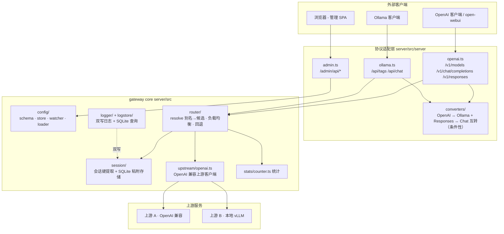
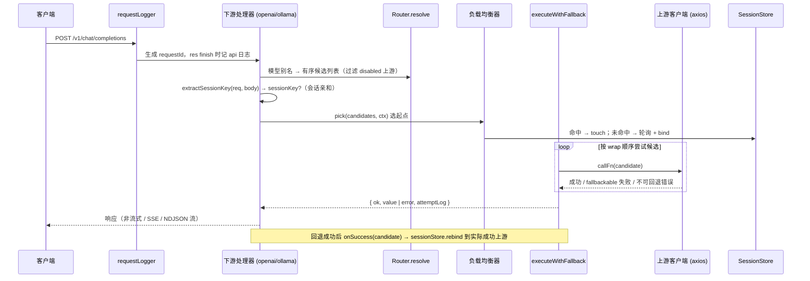
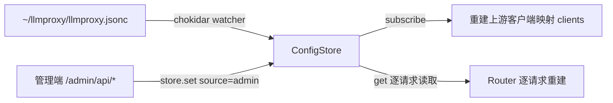

# llmproxy 整体架构

> 本文基于当前代码实际状态编写（`server/src` 与 `web/src`），描述单端口 LLM 网关的整体结构、请求链路、配置热载与数据目录。

## 1. 定位

llmproxy 是一个**单端口 LLM 网关**：聚合多个 OpenAI 兼容上游（upstream），对外暴露三类接口，全部监听在同一个端口（默认 `0.0.0.0:3000`，本机访问 `http://127.0.0.1:3000`）：

| 接口 | 前缀 | 说明 |
| --- | --- | --- |
| OpenAI 兼容 | `/v1` | `GET /v1/models`（聚合模型列表，60s 缓存）、`POST /v1/chat/completions`（非流式 + SSE 流式）、`POST /v1/responses`（Responses API：按上游原生支持能力分流——支持则原生透传、否则网关边界互转；非流式 + SSE 流式） |
| Ollama 兼容 | `/api` | `GET /api/tags`、`POST /api/chat`（NDJSON 流 / JSON 非流）、`POST /api/version` |
| 管理端 | `/admin/api` | 上游 CRUD / 连通性测试、下游模型映射、日志查询与清理、会话粘附管理、统计、健康检查 |
| 静态 SPA | `/` 其余路径 | Vue 3 + Element Plus 前端产物（`web/dist`），非 API 前缀请求回退到 `index.html` |

```
express 应用（单端口）
├── express.json({ limit: '10mb' })
├── requestLogger（requestId + 结构化请求日志）
├── /admin/api/*     管理端 REST（admin.ts）
├── /v1/*            OpenAI 兼容下游（openai.ts）
├── /api/*           Ollama 兼容下游（ollama.ts）
├── express.static(webDistPath)  静态 SPA
└── index.html 回退（/v1 /api /admin 之外的所有 GET）
```

SPA 产物缺失（全新检出未先 `pnpm --filter @llmproxy/web build`）时，回退路由返回 `503 { error: 'admin_ui_not_built' }` 而非抛 ENOENT。

监听地址解析优先级（`server/src/server/listen.ts`）：命令行 `--host` / `--port` > 配置文件 `server` 节 > 缺省值 `0.0.0.0:3000`；host/port 相互独立可选，未指定的一侧回落下一优先级；**不再支持环境变量 `HOST` / `PORT`**。socket 在进程启动时绑定，改动需重启进程生效。

## 2. 三层结构



### 2.1 gateway core（`server/src`）

- **config/**：`schema.ts`（Zod 配置结构）、`store.ts`（ConfigStore：内存态 + 原子持久化 + 变更通知）、`watcher.ts`（chokidar 文件监听）、`loader.ts`（JSONC 装载）。
- **router/**：`index.ts`（别名 → 有序候选列表）、`load-balancer.ts`（轮询 / 会话亲和）、`fallback.ts`（顺序回退执行器）。详见《会话亲和路由架构》。
- **session/**：`key.ts`（会话键提取）、`db.ts`（SessionStore：sessions 表）。
- **upstream/**：`openai.ts`（OpenAIUpstreamClient：模型列表 / 非流式 / SSE 流式，axios 实现，只发请求不做回退）。
- **stats/**：`counter.ts`（StatsCounter：按上游聚合请求数 / 错误数 / 总耗时，纯内存）。
- **logger/ + logstore/**：双写日志系统。详见《日志系统架构》。
- **paths.ts**：数据目录 / 配置文件 / 日志文件路径定位。

### 2.2 协议适配层（`server/src/server`）

- `openai.ts`：OpenAI 兼容下游，`/v1/chat/completions` 请求体原样透传；`/v1/responses` **按上游配置分流**——`responsesApi: 'native'` 时原生透传：请求体（除 `model` 改写为上游侧模型名、`stream` 按分支强制外）原样打给 `POST {baseUrl}/responses`，响应 JSON 与流式 SSE 事件原样回转（透传分支 404 视为可回退）；`responsesApi: 'convert'`（缺省）时在网关边界做 Responses ↔ Chat 互转（`converters/responses-*.ts`）。运行时探测已移除（responses-probe / registry 不再存在），改为管理端添加上游时用「检测」按钮确认该上游应配哪个值；非流式 / 流式（SSE）+ 顺序回退，每次尝试计数。
- `ollama.ts`：Ollama 兼容下游，通过 `converters/openai-to-ollama-*.ts` 把 OpenAI 上游的请求 / 响应 / SSE 流转成 Ollama 形状（`/api/show`、`/api/generate` 等明确不实现）。
- `converters/responses-*.ts`：Responses ↔ Chat Completions 边界转换（`responses-types` 类型、`responses-request` 请求、`responses-response` 非流式响应、`responses-stream` SSE 事件流），**convert 模式下使用**——`responsesApi: 'convert'`（缺省）时供 `openai.ts` 的 `/v1/responses` 使用。
- `admin.ts`：管理端全部端点（全局登录会话鉴权——白名单 `/auth/salt` / `/auth/login` / `/auth/status` / `/auth/logout` / `/health` 外的所有端点均需有效会话，未登录统一 `401 unauthenticated`；无 CORS，开发期走 web/vite 代理）。
- `downstreams.ts`：`DOWNSTREAM_ENDPOINTS` 单一真相源——启动日志与 `/admin/api/health` 共用，前端 Dashboard 自动跟随。
- `index.ts`：装配层（见下）。

### 2.3 管理端（`web/src`，Vue 3 + Element Plus）

- `views/`：Dashboard（健康 / 下游端点）、Upstreams、Models、Sessions、Logs、Stats。
- `api/client.ts`：调用 `/admin/api/*` 的客户端。

## 3. 装配层（`server/src/server/index.ts`）

`createApp(deps: { store: ConfigStore; webDistPath: string })` 组合整个应用，单例与依赖注入集中在此：

```ts
// 单例：会话粘附存储与日志存储共用同一 SQLite 文件（WAL 多连接安全）
const sessionStore = new SessionStore(join(getDataDir(), 'llmproxy.db'))
const logStore = new LogStore(join(getDataDir(), 'llmproxy.db'))
setLogStore(logStore) // 双写：所有 logger 调用同时写文件与 SQLite

// 会话亲和总开关：routing.sessionAffinity.enabled 缺省 true，仅显式 false 时退回纯轮询
const affinityEnabled = store.get().routing?.sessionAffinity?.enabled !== false
const loadBalancer = affinityEnabled
  ? new SessionAffinityLoadBalancer(sessionStore, new RoundRobinLoadBalancer())
  : new RoundRobinLoadBalancer()
```

- **上游客户端映射**：`clients: Map<upstreamId, OpenAIUpstreamClient>`，构造时构建并 `store.subscribe(rebuildClients)`——配置变更即时重建，新增 / 删除上游无需重启。
- **会话粘附自动清理**：启动执行一次 + `setInterval(cleanupIntervalMs).unref()`；保留期 `cleanupMaxAgeMs` 缺省 1 周；`cleanupIntervalMs` 为 0 时关闭调度。
- **日志 DB 清理**：`logStore.cleanup(RETENTION_DAYS * 24h)`，启动一次 + 每 6 小时（与文件 sweep 的 `SWEEP_INTERVAL_MS` 一致）。
- **统计钩子**：`onAttempt` 每上游尝试（成功 / 失败）都计入 StatsCounter。
- **路由器注入**：注入的 `router` 实例仅为满足 deps 形状；openai.ts / ollama.ts 实际按请求 `new Router(store.get())` 重建，保证配置变更即时生效、无过期引用。

## 4. 请求链路



细节要点：

- **requestLogger**（`logger/index.ts`）：每个请求 `nanoid()` 生成 `requestId`，挂在 `req.requestId` / `res.requestId`；`res.on('finish')` 输出一条 api 类别结构化日志（method / url / status / durationMs / 脱敏后的 headers），**绝不记录请求体与 Authorization / x-api-key**。
- **模型别名解析**（`router/index.ts` `Router.resolve`）：别名不存在抛 `ModelNotFoundError`；过滤 disabled 上游候选（保留配置顺序）；全部被禁用时记警告并按原列表返回，交给上层决策。
- **负载均衡**（`load-balancer.ts`）：`RoundRobinLoadBalancer` 按下游模型分桶轮询；`SessionAffinityLoadBalancer` 在无会话键时委托轮询、有会话键时粘附同一上游。候选为空抛 `EmptyCandidatesError`。
- **顺序回退**（`fallback.ts` `executeWithFallback`）：负载均衡只调用一次确定起点，同请求内后续回退按 wrap 顺序 `[start, ..., end, 0, ..., start-1]` 固定尝试；`isFallbackableAxiosError` 判定——网络错误（ECONNREFUSED / ETIMEDOUT / ECONNRESET / ENOTFOUND）、上游超时、429、5xx 可回退；401 / 403 等其它 4xx 不可回退、立即中断。每次尝试用 `process.hrtime.bigint()` 精确计时并记入 `attemptLog`。
- **流式中止**：`createRequestSignal` 用 AbortController + `res.on('close')` 自建信号，客户端断开即中止上游请求（不用 `req.on('close')`，它在请求体消费完即触发，会误中止）。
- **统计与日志贯穿**：每次上游尝试经 `onAttempt` 计入 StatsCounter；每次请求 / 每次尝试分别写入 api 日志与 app 日志。

## 5. 配置热载



- **ConfigStore**（`config/store.ts`）：持有唯一内存态 `current`；`set()` 先 `fastDeepEqual` 去重（防"写盘 → 监听 → 再 set"自环），再 Zod 校验，然后写 `${path}.tmp`（0600）原子重命名落盘，最后更新内存态并通知订阅者。`WatchSource` 区分 `'admin' | 'watch' | 'bootstrap'`。
- **watcher**（`config/watcher.ts`）：chokidar 监听配置文件，变更即重载；重载错误记入 `getRecentReloadError()`，启动时只告警不阻塞。
- **生效方式**：上游客户端映射由订阅重建（新增 / 删除上游即时生效）；下游处理器按请求 `new Router(store.get())` 重建（无过期引用）；`server.host/port` 与命令行 `--host/--port` 属进程级（socket 启动时绑定，改后需重启）；会话亲和开关在启动时确定，不做热更新重选。

## 6. 数据目录

统一位于 `~/llmproxy/`（由 `paths.ts` 定义，目录 0700）：

| 文件 / 目录 | 说明 |
| --- | --- |
| `llmproxy.jsonc` | 配置（JSONC：支持注释与尾逗号，0600）；首次运行写入 bootstrap 示例 |
| `llmproxy.db` | SQLite（WAL）：`sessions` 表 + `logs` 表共存，SessionStore 与 LogStore 各持一个连接 |
| `logs/` | `app-YYYY-MM-DD.log`（文本 pattern）与 `api-YYYY-MM-DD.log`（JSON），按日轮转 |
| `log4js.json` | log4js 配置（0600），首次启动自动写入默认值，运维可编辑 |

## 7. 模块树简表

```
server/src/
├── server/           装配与协议适配（index / openai / ollama / admin / downstreams / listen）
├── config/           schema · store · watcher · loader（JSONC 校验与热载）
├── router/           resolve 别名解析 · 负载均衡（轮询/会话亲和）· 顺序回退
├── session/          会话键提取（key）· 粘附存储（db，sessions 表）
├── logstore/         日志 SQLite 存储（logs 表：insert/query/cleanup/deleteBefore）
├── logger/           双类别 log4js · 双写 Proxy · 请求日志中间件 · 保留期清理（sweep）
├── upstream/         OpenAI 兼容上游客户端（axios，非流式 + SSE）
├── converters/       OpenAI ↔ Ollama 转换 + Responses ↔ Chat 边界转换（条件性，仅上游不支持原生 Responses 时）
├── stats/            纯内存统计计数器
└── paths.ts          数据目录 / 日志路径定位

web/src/
├── views/            Dashboard · Upstreams · Models · Sessions · Logs · Stats
└── api/client.ts     /admin/api 客户端
```

## 8. 相关文档

- [会话亲和路由架构](session-affinity.md)
- [日志系统架构](logging.md)
